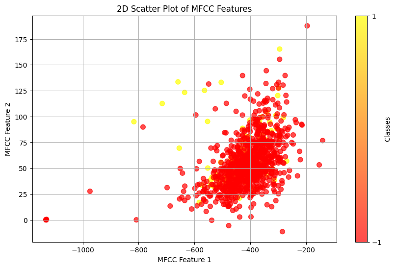
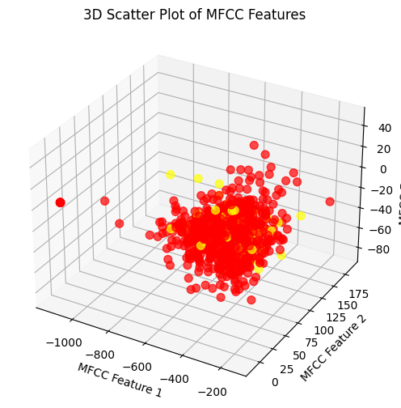

# Proyecto de Clasificación de Audio: SVM y Regresión Logística

Este proyecto implementa modelos de **Máquina de Vectores de Soporte (SVM)** y **Regresión Logística** para clasificar datos proporcionalmente desbalanceados con clases predominantes de audio de toses de personas con covid como "positivos" y "negativos" a covid-19. Se incluye la carga y procesamiento de los datos, entrenamiento de los modelos, evaluación de rendimiento y validación cruzada.

## Contenido

- [Instalación](#instalación)
- [Estructura del Proyecto](#estructura-del-proyecto)
- [Descripción de los Modelos](#descripción-de-los-modelos)
- [Evaluación del Rendimiento](#evaluación-del-rendimiento)
- [Validación Cruzada y Bootstrap](#validación-cruzada-y-bootstrap)
- [Preprocesamiento y Manejo de Datos Desbalanceados](#preprocesamiento-y-manejo-de-datos-desbalanceados)
- [Referencias](#referencias)

## Instalación

```bash
pip install numpy pandas matplotlib seaborn librosa cvxopt pywavelets
```

## Estructura del Proyecto

1. **Preprocesamiento**:
   - Balanceo de clases mediante reducción de datos negativos y técnicas como SMOTE.
   - Transformaciones de características utilizando la transformada de `Fourier` y `MFCC`.
   - Visualización de datos antes y después del balanceo, incluyendo gráficos de dispersión en 2D y 3D.

2. **Entrenamiento de Modelos**:
   - **SVM**: Implementación desde cero, incluyendo normalización, funciones de pérdida y derivadas, y actualización de parámetros.
   - **Regresión Logística**: Implementación de funciones de costo, derivadas, y ajuste de parámetros.

3. **Evaluación de Modelos**:
   - Generación de la matriz de confusión, precisión, recall, y F1-score.
   - Validación cruzada K-Fold y Bootstrap.
## Preprocesamiento y Manejo de Datos Desbalanceados

### Imágenes de Visualización de Datos

Antes de aplicar las técnicas de balanceo, visualizamos los datos para observar el desbalance de clases. Usamos gráficos en 2D y 3D para este propósito.





**Título**: Manejo de Datos Desbalanceados

**Descripción**:  
Podemos ver que la data no se encuentra balanceada y con dificultad para dividirla en 2 clases distintas debido a que la cantidad de datos pertenecientes a la clase de "negativos" predomina enormemente sobre la clase de "positivos" a covid-19. Ante ello, disminuimos la cantidad de elementos en la clase "negativo" para equilibrar los datos y mejorar la clasificación de los audios.

**Técnicas Utilizadas**:
- **SMOTE (Synthetic Minority Over-sampling Technique)**: Generación de nuevos ejemplos de la clase minoritaria.
- **Downsampling**: Reducción de la clase mayoritaria para equilibrar las clases.

### Balanceo de Clases

Se aplicaron las técnicas de balanceo para asegurar que el modelo entrenara con una distribución de clases más equilibrada. Esto se logró reduciendo la clase mayoritaria mediante `downsampling` y aumentando la clase minoritaria con la técnica SMOTE.

## Descripción de los Modelos

### Máquina de Vectores de Soporte (SVM)

El modelo de SVM está implementado desde cero, incluyendo:

- **Normalización**: Usando RobustScaler.
- **Función de Pérdida**: La función de pérdida se calcula como una combinación de regularización y margen de error.
- **Derivadas y Actualización de Parámetros**: Ajustes en los parámetros w y b mediante gradiente descendente.

### Regresión Logística

La regresión logística se implementa con regularización L2 y ajuste de hiperparámetros usando BorderlineSMOTE para el balanceo de datos. La función sigmoide se usa para la predicción, y se aplica un umbral de 0.15 para clasificar los datos.

## Evaluación del Rendimiento

El rendimiento de los modelos fue evaluado utilizando varias métricas de clasificación:

- **Matriz de Confusión**: Para SVM y Regresión Logística.
- **Precisión, Recall y F1-Score**: Métricas para medir la efectividad de la clasificación.
- **Validación Cruzada**: Se utilizó K-Fold y Bootstrap para evaluar la estabilidad y generalización de los modelos.

### Resultados:

#### Regresión Logística
- **Precisión**: 90%
- **Recall**: 92%
- **F1-Score**: 91%

#### SVM
- **Precisión**: 56%
- **Recall**: 84%
- **F1-Score**: 67%

## Evaluación del Rendimiento

- **Matriz de Confusión**: Generada para visualizar el rendimiento del modelo SVM y de regresión logística.
- **Métricas de Clasificación**: Incluye precisión, recall, F1-score y exactitud.

La validación cruzada K-Fold se utilizó para obtener métricas más confiables y evaluar la estabilidad de los modelos. Para ello, se experimentó con diferentes valores de `K` y se graficó la precisión en función de `K`.

### Bootstrap

Se utilizó la técnica de Bootstrap para estimar la precisión de los modelos mediante remuestreo de los datos.

## Referencias

- [SMOTE: Synthetic Minority Over-sampling Technique](https://arxiv.org/abs/1106.1813)
- [Scikit-learn: SVM](https://scikit-learn.org/stable/modules/svm.html)
- [Scikit-learn: Logistic Regression](https://scikit-learn.org/stable/modules/linear_model.html#logistic-regression)
